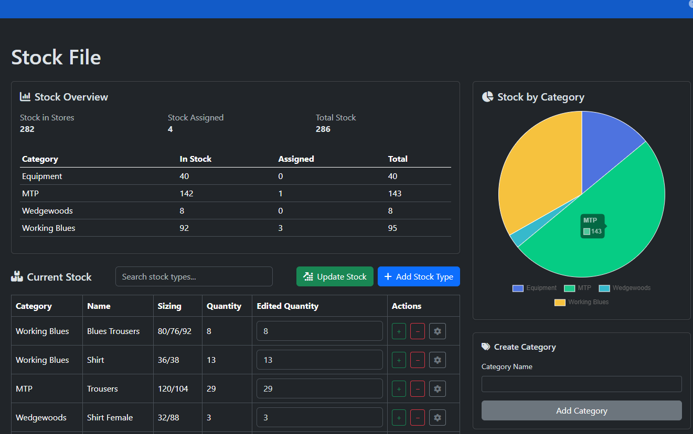

# StoreStash

StoreStash is a stock management solution which incorporates stock logging and assignment. The software allows users to view stock amounts, assign items to users and update stock amounts during delivery.

## Features
StoreStash includes several quality-of-life features such as:
- Secure user registration
- Rate Limiting
- Support Tickets
- Theme Settings

With these features, StoreStash uses an online database to store stock and user data.

## Implementation
This application is specifically designed for a separate stakeholder, and so this application mirrors their needs. Please see the support section for inquiries on using the software for any corporate means.

## Demo
A demo of the application can be found [here](https://storestash.onrender.com). If the application has not been used in a while, it may take a little for it to 'spin up' into action. For the username and password for the demo, please contact the developer in the support section.

## Support
### Support Tickets
Whilst using the application, users who encounter unexpected errors may open support tickets which notify the developer of the issue presented. Abusing this privilege will result in users being barred from creating support tickets, with no appeal possible.
### Non-Developer Issues
Any issues with changing privileges, resetting passwords or deleting users should be directed to an application admin, and not the developer. Any issues which concern data stored within external databases should be directed to the database admin, and not the developer, unless the developer is the database admin.
### Important/Implementation Issues
For issues which require immediate attention, such as security flaws or application implementation, the developer should be contacted at the earliest possible opportunity at jan.korzybski@proton.me, or through [issues](https://github.com/shr0m/StoreStash/issues)
